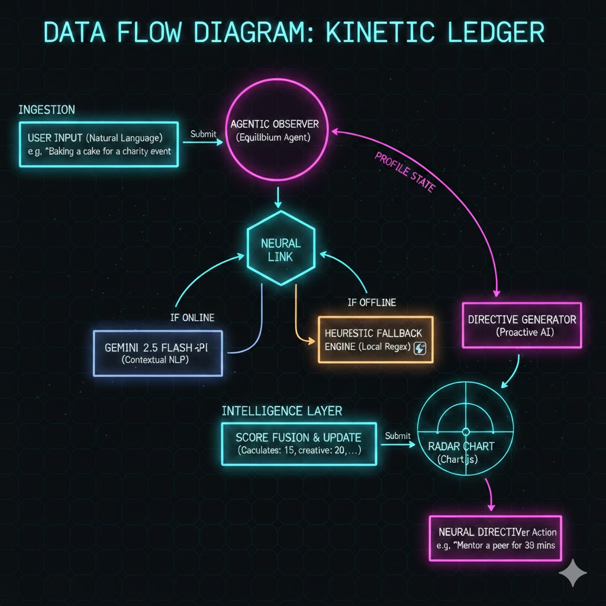

Kinetic Ledger: System Architecture
1. High-Level Overview
Kinetic Ledger is built on a Hybrid Intelligence Architecture. It bridges raw human experience with structured data through a dual-path processing engine, ensuring that the user’s "Evolution Profile" is always synchronized, regardless of network availability or API latency.

2. Data Flow Diagram
The system follows a reactive loop where user input is transformed into kinetic data and subsequently analyzed by an autonomous agent.

Ingestion: User describes a real-world activity in natural language.

Neural Link: The system initiates a request to the Gemini 2.5 Flash API.

Branching Logic:

Online Path: The LLM performs contextual NLP to extract specific growth scores across five vectors.

Offline Path: The Heuristic Engine identifies keywords via local RegEx and applies pre-calculated weights to ensure the UI remains functional.

Score Fusion: The engine updates the global state and triggers a re-render of the Radar Chart (Chart.js).

Agentic Intervention: The Equilibrium Agent analyzes the new profile shape and generates a proactive "Neural Directive."

3. Core Components
Neural Extraction Layer (Primary)
Utilizes Gemini 2.5 Flash to perform high-fidelity contextual extraction. It understands nuanced effort—distinguishing, for example, between the "Creative" act of baking and the "Social" act of organizing a baking event.

Heuristic Fallback Engine (Secondary)
A deterministic, local engine designed for production-level resilience. It ensures 100% system uptime by providing "Evolution Synchronization" even during API interruptions or 404 connection errors.

Agentic Observer (The Brain)
An autonomous monitoring loop that triggers after every profile update. It calculates variance across the user's Human Profile to identify sectors of stagnation or growth gaps.

Directive Generator
A proactive AI agent that generates Evolution Tasks—actionable, real-world challenges designed to restore equilibrium to the user's skill tree.

4. Technical Specifications

Feature,Implementation,Benefit
Modular Logic,/core/engine.js,Separation of concerns; Scalable architecture.
Intelligence,Gemini 2.5 Flash,Advanced NLP reasoning for impact scoring.
Redundancy,Local Heuristic Regex,Production-grade resilience and offline-first capability.
UI/UX,Glassmorphism + Radar Charts,High-fidelity data visualization for user motivation.
